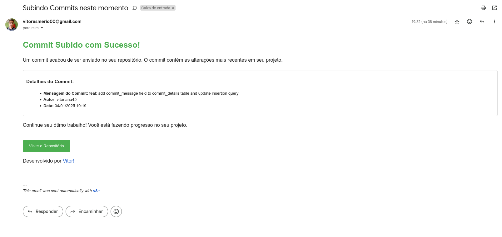

# Sistema de Notificação de Commits via N8N

## Visão Geral
Sistema implementado no N8N que monitora commits em um repositório GitHub através de webhook. Ao detectar um novo commit, o sistema armazena os dados em um backend via HTTP e envia uma notificação por email usando SMTP do Gmail.



## Implementação Atual

### Fluxo N8N
O workflow implementado possui os seguintes nodes:
1. **Webhook GitHub**: Recebe eventos de commit
2. **HTTP Request**: Envia dados para o backend com as seguintes configurações:
   - Método: POST
   - URL: http://seu-backend.com/api/commits
   - Headers: 
     - Content-Type: application/json
   - Body (JSON):
     ```json
      [
      {
        "committer_username": "vitorlana45",
        "committer_email": "vitoresmerio00@gmail.com",
        "modified_files": "[\"src/index.js\",\"src/init-db.sql\"]",
        "real_ip": "140.82.115.44",
        "event_type": "push",
        "pushed_at": 1736027318,
        "commit_id": "9303680ae7ede6d1755d639d27069789cdc5f384",
        "developed_by": "https://github.com/vitorlana45",
        "commit_message": "feat: add commit_message field to commit_details table and update insertion query"
      }
      ]
     ```
3. **Date Formatter**: Converte timestamp para formato legível
4. **Email**: Envia notificação usando template HTML

### Dados Processados
O sistema captura e processa:
- Mensagem do commit
- Nome do autor
- Data/hora do commit
- URL do repositório

### Template de Email
O sistema utiliza um template HTML responsivo que exibe:
- Título com confirmação do commit
- Detalhes formatados do commit
- Link para o repositório
- Assinatura do desenvolvedor


### Integração com Backend
- Endpoint configurado para receber dados do N8N
- Dados são enviados via HTTP request POST
- JSON payload contém informações do commit

## Componentes Utilizados
- Webhook GitHub configurado no repositório
- Workflow N8N com nodes específicos
- Backend com endpoint HTTP para receber commits
- Conta SMTP do Gmail para emails